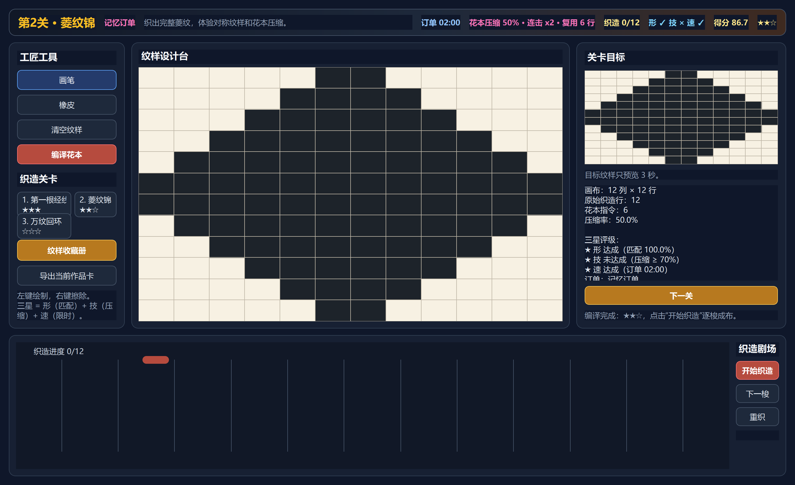
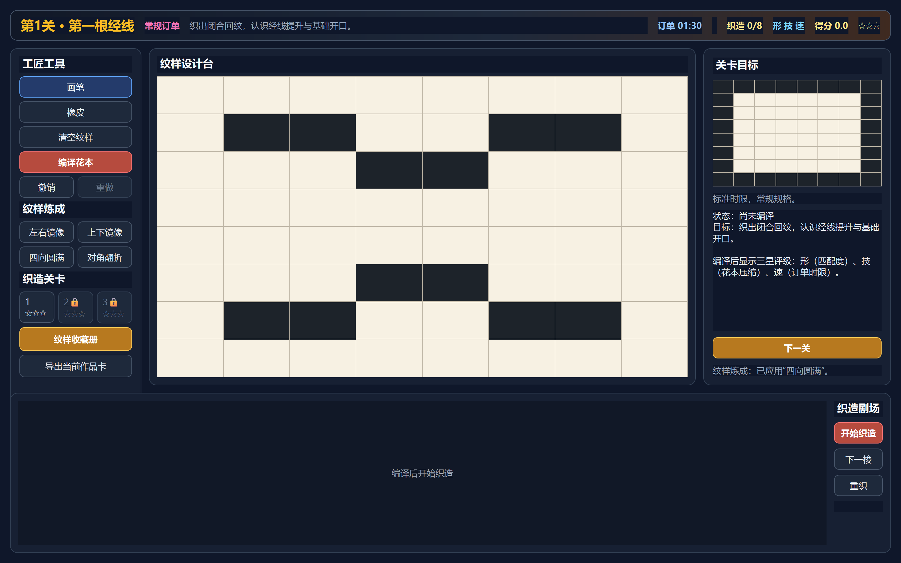
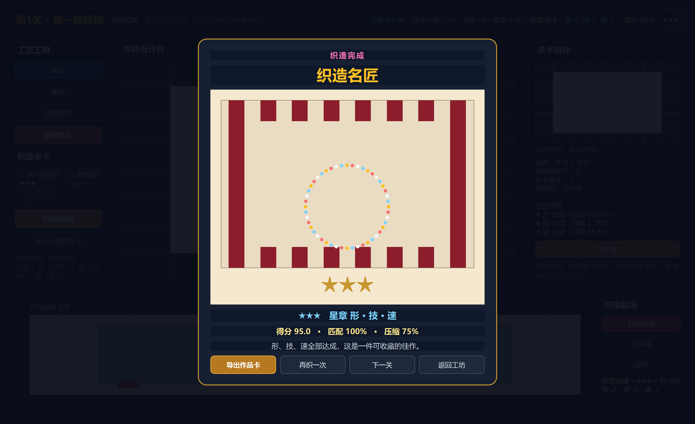
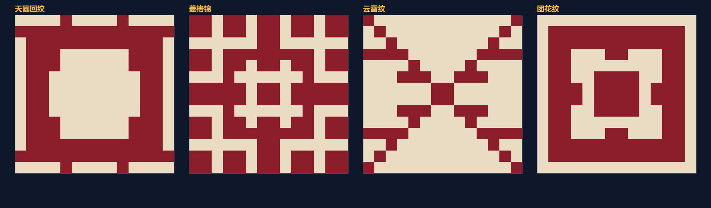
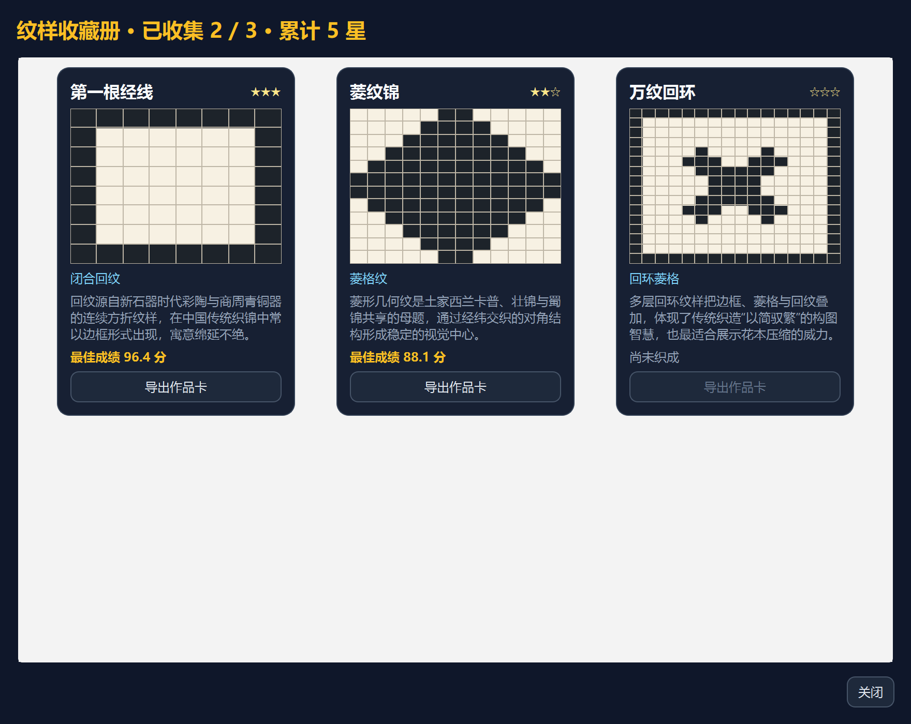
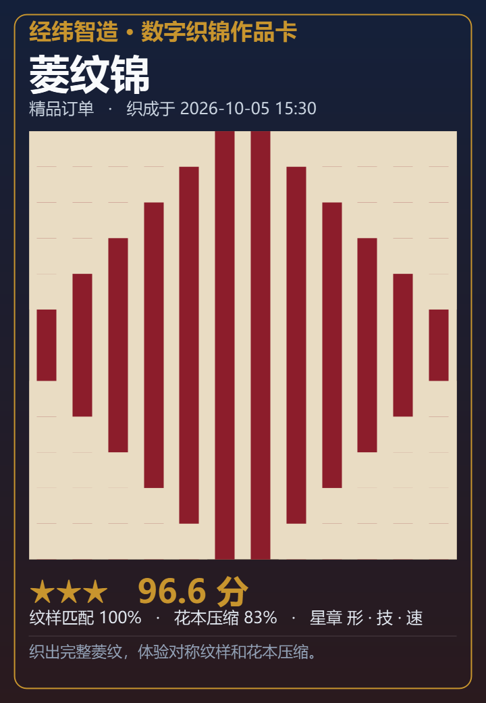

# 经纬智造 · 花楼提花机的可编程密码

> 一款把中国传统花楼提花工艺转化为“可设计、可编译、可织造、可验证”交互体验的非遗文化教育软件。

[](https://github.com/akbar747/jingwei-zhizao/actions/workflows/tests.yml)


参赛方向：第十四届全国大学生数字媒体科技作品及创意竞赛  
赛道定位：指定命题类——民族文化创新表达  
作品形态：Windows离线桌面软件  
当前状态：织造工坊 Game Loop 已完成，含三星评级、纹样收藏册、进度存档、订单变体、纹样炼成、程序化灵感纹样、撤销重做、通关庆典与作品卡导出



## 织造工坊玩法

### 游戏循环

1. **接单**：进入关卡时随机获得一种“织坊订单”（加急 / 精品 / 记忆 / 盲织），同一关卡会有不同玩法。
2. **绘制**：在点阵画布上按目标纹样绘制，左键填色、右键擦除，修改后旧编译结果自动过期。
3. **编译**：把纹样编译为花本指令，界面即时给出“连击 xN”“复用 N 行”的压缩反馈。
4. **织造**：点击“开始织造”或“下一梭”，在限时内逐梭推进，观察梭子穿行与布料生长。
5. **收藏**：完成后按“形 / 技 / 速”三颗星结算，成绩写入 `%APPDATA%\JingweiZhizao\progress.json`，目标纹样收入纹样收藏册，并解锁下一关。

### 纹样炼成与编辑手感

- **一键对称**：左右镜像、上下镜像、四向圆满、对角翻折，把一小段手绘自动扩展成传统织锦常见的对称构图。
- **整笔撤销/重做**：一次拖动算一笔，`Ctrl+Z` / `Ctrl+Y` 可整体撤销或恢复；纹样炼成同样一步可撤销。
- **通关庆典**：织造完成后弹出结算层，展示成品织物、扩散粒子、三颗星、匹配率、压缩率与鼓励文案，并可直接导出作品卡或进入下一关。





### 程序化灵感纹样（离线、可复现）

- 「灵感纹样」按钮用确定性随机种子生成四种传统风格纹样：**天圆回纹、菱格锦、云雷纹、团花纹**。
- 同一种子永远生成同一件纹样，因此可复现、可出题，也方便教学演示。
- 生成器完全离线、纯 Python，是自由创作与课堂命题的内容引擎。



### 三星评级：同一件作品，三重目标

| 星星 | 条件 | 对应能力 |
|---|---|---|
| ★ 形 | 纹样匹配度 ≥ 98% | 忠实复现传统纹样 |
| ★ 技 | 花本压缩率 ≥ 订单门槛（常规70%，精品85%） | 理解可编程提花指令优化 |
| ★ 速 | 在订单时限内完成 | 匠人织造效率 |

三颗星相互独立，因此同一个纹样有明确的重玩目标，而不是只有一个模糊总分。

### 织坊订单：让每关都不一样

| 订单 | 规则 | 玩法变化 |
|---|---|---|
| 常规订单 | 标准时限 | 熟悉规则 |
| 加急订单 | 时限压缩 45% | 拼节奏 |
| 精品订单 | 压缩率需 ≥ 85% | 迫使玩家真正优化花本 |
| 记忆订单 | 目标纹样只预览 3 秒 | 拆解纹样结构 |
| 盲织订单 | 隐藏实时匹配提示 | 凭真功夫织造 |

### 纹样收藏册与作品卡

- 三个关卡对应三件可收藏的纹样，附民族文化注解与最佳成绩。
- 收藏册汇总“已收集 N/3”和“累计星数”，未解锁条目显示为待发现。
- 每件完成作品都可一键导出为 PNG **织锦作品卡**，包含织物纹理、星级、匹配率、压缩率和文化说明，可直接用于答辩材料。




## 运行方式

当前 `main` 分支源码已包含完整升级（可通过下方“安装与运行”从源码启动）。

已发布的可下载安装包为 `v0.2.9`，可通过 [最新 Release](https://github.com/akbar747/jingwei-zhizao/releases/latest) 获取：

- `JingweiZhizao-Setup-0.2.9.exe`：推荐，双击安装，无需Python和管理员权限。
- `JingweiZhizao-Portable-0.2.9.zip`：解压后直接运行，适合演示和课堂临时使用。
- `SHA256SUMS.txt`：发布文件SHA256校验值。

> 说明：`0.3.0` 的新玩法（纹样炼成、撤销重做、通关庆典）已合并到 `main` 源码，安装包将在下一次打包时同步更新。
## 评审快速体验

1. 启动软件，默认进入第 1 关，顶部显示随机订单与倒计时。
2. 参照右侧“关卡目标”，在中央点阵画布用左键绘制纹样，右键或“橡皮”擦除。
3. 点击左侧“编译花本”，查看匹配率、花本压缩、连击反馈和三颗星达成情况。
4. 点击“开始织造”或“下一梭”，观察梭子穿行与布料生长；也可点“重织”重放。
5. 织造完成后成绩自动存档并解锁下一关，点击左侧“纹样收藏册”查看收藏与导出作品卡。
6. 左侧关卡栏可切换关卡（需先通关解锁）；点击“导出当前作品卡”可得到 PNG 成品图。

## 一、项目解决的问题

传统提花工艺展示常见两个问题：观众只能看到复杂的织机和漂亮成品，却看不懂“纹样如何变成机械动作”；普通计算机教学又很少能从真实文化工艺切入。

《经纬智造》把两者连接起来。用户不是在软件里观看一段织布动画，而是在点阵画布中亲自设计纹样，再观察软件如何把纹样编译成花本指令、控制经线提升并生成织物结果。

核心链路：

```text
点阵纹样
   ↓ 逐行解析
提升经线集合
   ↓ 相同组合去重
花本提花指令 C01、C02……
   ↓ 状态推进
织物矩阵与成品预览
```

## 二、创新点

### 1. 不是动画播放器，而是可验证映射

每个织物单元都能追溯到原始纹样位置、花本编号、提升经线和对应梭次。视觉动画负责表现状态，结果本身由确定性算法生成。

### 2. 把“花本”解释为可执行程序

软件把连续相同的提升行合并成可复用指令，直观展示：

- 离散数据如何表达图案；
- 指令如何存储和复用；
- 机械如何读取并执行信息；
- 输入变化如何影响织造结果。

### 3. 民族文化与计算机科普的双向翻译

界面同时保留两套语言：

| 工艺术语 | 计算类比 |
|---|---|
| 点阵纹样 | 输入数据 |
| 花本 | 指令集或程序数据 |
| 提升组合 | 状态参数 |
| 综片/花楼 | 执行机构 |
| 梭子 | 数据写入 |
| 打纬 | 状态提交 |
| 织物矩阵 | 输出结果 |

### 4. 面向课堂与博物馆的真实应用

目标用户包括中学信息科技、劳动教育学生、博物馆科普观众和非遗教育工作者。软件不依赖网络，可以在普通Windows电脑、触摸屏或教学机房中运行。

## 三、功能完成度

| 模块 | 当前状态 | 验证证据 |
|---|---|---|
| 点阵绘图与擦除 | 已完成 | 真实鼠标交互测试 |
| 纹样边界与矩阵校验 | 已完成 | PatternGrid单元测试 |
| 花本编译与重复行复用 | 已完成 | 编号顺序与次数测试 |
| 织物矩阵生成 | 已完成 | 确定性与非法输入测试 |
| 结果过期提示 | 已完成 | 主窗口冒烟测试 |
| 三颗独立星级（形/技/速） | 已完成 | StarEngine 单元测试与主窗口冒烟测试 |
| 纹样收藏册与解锁进度 | 已完成 | Album 目录测试与离屏 GUI 测试 |
| 关卡进度存档 | 已完成 | ProgressStore 存档往返与损坏回退测试 |
| 织坊订单变体 | 已完成 | 订单修饰与门槛测试 |
| 逐梭织造预览与完成粒子 | 已完成 | 织造动画状态机测试 |
| 织锦作品卡 PNG 导出 | 已完成 | Artifact 渲染与保存测试 |
| 纹样炼成对称工具 | 已完成 | Symmetry 变换与撤销测试 |
| 整笔撤销/重做 | 已完成 | PatternHistory 单元测试与冒烟测试 |
| 通关庆典结算层 | 已完成 | Finale 摘要与覆盖层测试 |
| 程序化纹样生成 | 已完成 | Generator 确定性与风格测试 |
| 精细3D花楼和布料物理 | 计划中 | 尚未实现 |
| CSV、WIF导出 | 计划中 | 尚未实现 |
| Windows免安装程序 | 计划中 | 尚未实现 |

### 已完成MVP

- 16×16默认点阵画布，左键绘制、右键擦除、橡皮模式、清空纹样。
- 按行解析纹样并提取被提升的经线，相同提升组合自动复用同一花本编号。
- 显示原始织造行、唯一花本数量、压缩率、花本列表与“连击 xN”反馈。
- 修改纹样后自动提示“结果已过期”。
- 织物矩阵生成和非法数据校验，逐梭织造动画与完成粒子庆祝。
- 三颗独立星级（形/技/速）与五种织坊订单变体。
- 纹样收藏册、关卡解锁与 JSON 进度存档。
- 纹样炼成：一键左右/上下/四向/对角对称，可整体撤销。
- 整笔撤销/重做（撤销、重做按钮与 Ctrl+Z/Ctrl+Y）。
- 程序化灵感纹样：四种传统风格、同种子可复现。
- 通关庆典结算层与织锦作品卡 PNG 导出。
- Qt离屏冒烟测试，可在无人点击环境验证主流程。
- Windows CI自动测试配置。

## 四、尚未实现

以下功能属于后续迭代，不应混入当前MVP验收：

- 精细3D花楼、绳索和布料物理。
- CSV和WIF导出（PNG作品卡已完成）。
- `.jwg`工程保存与恢复。
- 撤销、重做、直线、矩形、填充和镜像工具。
- PyInstaller免安装Windows程序。
- 用户测试和兼容性测试报告。

## 五、技术架构

```text
表现层 presentation
  MainWindow
  PatternCanvas
  Canvas Geometry

应用层 application
  CompileService

领域层 domain
  PatternGrid
  CompilePattern / WeavePlan / Card / Pick
  WeaveMatrix

游戏层 game
  StarEngine（三星评级）
  OrderModifier（织坊订单）
  ProgressStore（进度存档）
  Album（纹样收藏册）
  ArtifactCard（作品卡渲染）
  ResultSummary（通关结算摘要）
  PatternGenerator（程序化纹样）

编辑层 ui
  PatternHistory（撤销/重做）
  SymmetryMode（纹样炼成）
  CelebrationOverlay（通关庆典）

测试
  Unit Tests
  Qt Offscreen GUI Tests
  Application Smoke Test
```

技术选型：

- Python 3.13+（发布构建固定为3.13）
- PySide6-Essentials 6.11.2
- Python标准库 `unittest`
- 领域层零Qt依赖
- 当前运行完全离线，不调用外部API

## 六、核心语义

- `True`：该列经线在对应梭次被提升。
- `False`：该列经线不提升。
- 花本编号按首次出现顺序分配：`C01`、`C02`、`C03`。
- 织物矩阵：提升经线覆盖当前纬线记为 `True`，否则为 `False`。

当前模型是为教学演示设计的确定性模型，不宣称是对某台实体花楼提花机的逐零件工程复刻。

## 七、安装与运行

```powershell
git clone https://github.com/akbar747/jingwei-zhizao.git
cd jingwei-zhizao
python -m venv .venv
.\.venv\Scripts\python.exe -m pip install -e .
$env:PYTHONPATH='src'
.\.venv\Scripts\python.exe -m jingwei
```

## 八、自动测试

```powershell
$env:QT_QPA_PLATFORM='offscreen'
$env:PYTHONPATH='src'
.\.venv\Scripts\python.exe -m unittest discover -s tests -v
```

无窗口冒烟检查：

```powershell
$env:QT_QPA_PLATFORM='offscreen'
$env:PYTHONPATH='src'
.\.venv\Scripts\python.exe -m jingwei --smoke-test
```

当前验证结果：

```text
Ran 126 tests
OK
Smoke test exit code: 0
```

## 九、项目结构

```text
jingwei-zhizao/
├─ .github/workflows/         GitHub Actions
├─ src/jingwei/
│  ├─ application/            应用服务
│  ├─ domain/                 纯Python领域模型与算法
│  └─ ui/                     PySide6界面
├─ tests/                     单元测试、GUI测试与冒烟测试
├─ docs/
│  ├─ ai-log/                 AI使用证据
│  ├─ design/                 UI与交互设计
│  ├─ review/                 评审清单
│  ├─ screenshots/            展示截图
│  └─ superpowers/            策划书与实施计划
├─ pyproject.toml
└─ README.md
```

## 文档导航

- [项目策划书](docs/superpowers/specs/2026-10-04-jingwei-zhizao-design.md)
- [UI交互设计](docs/design/ui-interaction-design.md)
- [MVP实施计划](docs/superpowers/plans/2026-10-04-mvp-drawing-compile.md)
- [AI使用记录](docs/ai-log/2026-10-04.md)
- [GitHub发布指南](docs/github-publish-guide.md)
- [测试说明](tests/README.md)

## 十、开发与质量控制

- 领域层不得导入PySide6。
- 所有核心算法必须在GUI之外可测试。
- 新行为先写失败测试，再写最小实现。
- 使用确定性算法，相同输入必须得到相同输出。
- 每次代码变更必须运行完整测试。
- 不把生成缓存、虚拟环境、密钥或来源不明素材提交到仓库。

## 十一、AI使用与原创性

本项目的AI参与记录保存在 [`docs/ai-log/`](docs/ai-log/)。记录内容包括工具名称、使用环节、输入、输出、人工修改和核验状态。

当前软件运行时**不调用任何AI接口**。AI主要用于辅助需求整理、代码生成、测试设计和文档初稿，最终功能、边界和采用内容由项目团队审核。

## 十二、当前限制

- 尚未在真实Windows窗口进行最终视觉验收。
- 尚未完成打包后的独立运行测试。
- 历史说明和民族文化来源需要项目负责人进一步核验。
- 当前纹样编辑只支持基础点阵和单色提升模型。

## 十三、后续路线

1. 增加保存/打开、撤销/重做、CSV/WIF导出与自由创作命名。
2. 完成打包后的 Windows 10/11 独立运行与兼容性测试。
3. 增加真实用户测试，记录完成时间、学习效果与重玩率。
4. 扩展更多民族纹样关卡、每日挑战与课堂任务包。
5. 形成演示视频脚本、作品介绍、原创声明和AI使用说明。
6. 在不影响核心闭环的前提下，探索织机3D结构与布料物理表现。

## 十四、仓库说明

本仓库当前用于竞赛作品开发与版本管理。正式提交前，所有示例素材、历史说明和AI使用记录都必须完成来源核验。